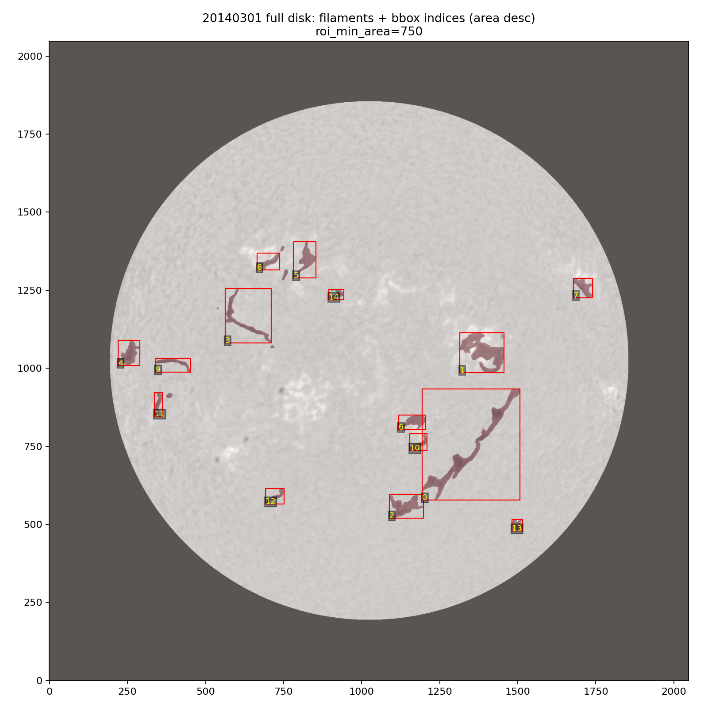
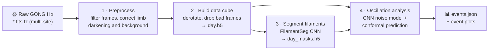
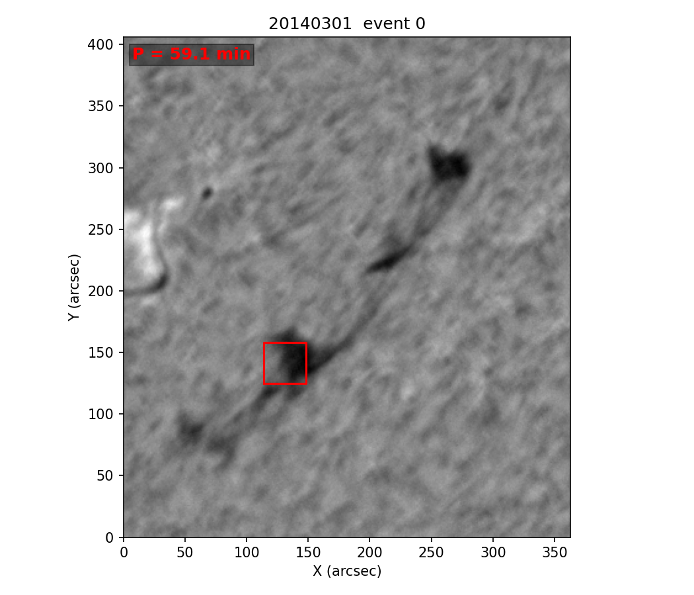
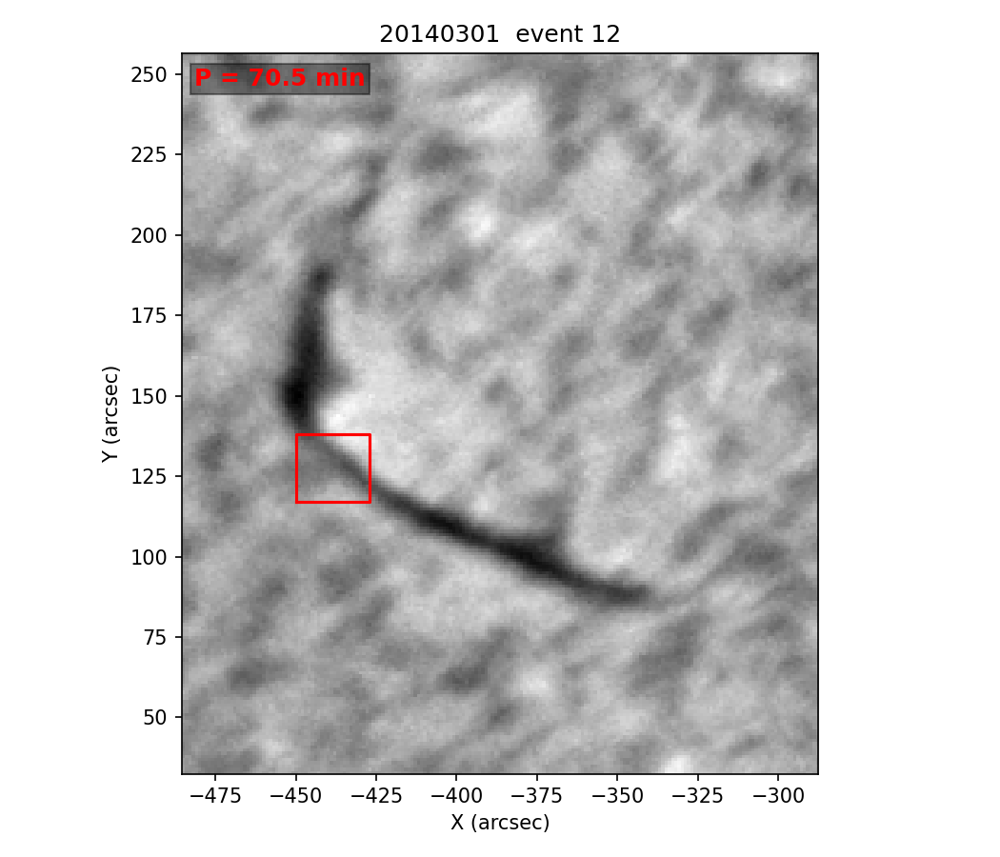

# SolFilOsc — Solar Filament Oscillation Detection

**Automatic detection of solar filament oscillations in GONG Hα image sequences**, powered by a CNN-accelerated Bayesian spectral analysis and conformal-prediction significance thresholds.

[](https://www.python.org/)
[](LICENSE)
[](https://arxiv.org/abs/2607.01095)
[](https://doi.org/10.1051/0004-6361/202660956)

<p align="center">
  
  <br/>
  <sub>A processed GONG Hα full-disk frame (2014-03-01): every filament segmented and boxed, ready for oscillation analysis.</sub>
</p>

Filaments (prominences seen against the disk) oscillate with periods of tens of minutes to hours, and those motions encode the structure and stability of their magnetic support. Finding the oscillations used to mean visual inspection and manually placed slits. **SolFilOsc scans entire days of full-disk Hα data and finds them automatically:**

- 🧹 **Preprocessing** — merges and filters raw multi-site GONG frames into one clean, derotated daily data cube.
- 🎭 **Segmentation** — deep-learning masks ([FilamentSeg](https://huggingface.co/datasets/antonio-reche/SWEFil)) locate every filament on the disk.
- 📈 **Detection** — per-pixel Lomb–Scargle power spectra, a CNN that infers the red-noise background in milliseconds, and conformal-prediction thresholds turn significant spectral peaks into catalogued **oscillation events** with periods, positions, and strengths.

The method is described in [Castelló, Luna & Terradas (2025, A&A)](https://doi.org/10.1051/0004-6361/202452928) and [Castelló, Luna & Terradas (2026, arXiv:2607.01095)](https://arxiv.org/abs/2607.01095) — see [Citing this work](#citing-this-work).

---

## How it works



1. **Preprocess** (`solfilosc.data_processing.preprocess_data`) — selects the best telescope per observing window (cadence and sharpness filters across the GONG network sites), then removes limb darkening and large-scale background structure from every frame.
2. **Build the data cube** (`solfilosc.data_processing.create_data_cube_file`) — derotates all frames to a common reference time, drops corrupted frames, matches intensity across telescope handoffs, and writes a single `T×2048×2048` HDF5 cube per day.
3. **Segment filaments** (`segment_filaments.py` + the external [FilamentSeg](#filament-masks-filamentseg) models) — produces per-frame binary and per-type filament masks.
4. **Analyze oscillations** (`solfilosc-analysis`) — for each filament, at multiple spatial scales: compute per-pixel Lomb–Scargle PSDs, let the CNN predict the red-noise model `a·f^-α + b` for each spectrum, and flag peaks that exceed a conformal-prediction threshold calibrated daily on quiet-Sun pixels. Coherent detections are clustered into events.

## Example output

Each analyzed day produces a JSON event catalogue and one plot per event: the filament region with the oscillating patch boxed and its period annotated.

<table>
  <tr>
    <td align="center"><br/><sub>2014-03-01, event 0 — P = 59.1 min</sub></td>
    <td align="center"><br/><sub>2014-03-01, event 12 — P = 70.5 min</sub></td>
  </tr>
</table>

A single entry of `<day>_events.json`:

```jsonc
{
  "event_index": 12,
  "filament_index": 3,
  "period_mean_min": 70.5,     // mean oscillation period (minutes)
  "strength": 32.8,            // integrated significance above the CP threshold
  "event_bbox":    {"min_y": 1140, "min_x": 573, "max_y": 1161, "max_x": 596},
  "filament_bbox": {"min_y": 1056, "min_x": 538, "max_y": 1280, "max_x": 736},
  "centroid_x": 584.5,
  "centroid_y": 1149.7,
  "scales": [20, 18, 17, 16, 14, 13, 12, 11, 10, 9]   // spatial scales (px) confirming the event
}
```

## Quickstart

```bash
git clone https://github.com/GuillemCastello/SolFilOsc.git
cd SolFilOsc

python3 -m venv .venv
source .venv/bin/activate
pip install --upgrade pip
pip install -r requirements.txt
pip install -e .
```

Process one day of data (raw GONG `.fits.fz` files under `data/raw/<month>/<day>/`, e.g. `data/raw/201401/20140102/`):

```bash
# 1–2 · preprocess and build the daily cube (last argument = number of workers)
python3 -m solfilosc.data_processing.preprocess_data      2014 201401 20140102 16
python3 -m solfilosc.data_processing.create_data_cube_file 2014 201401 20140102 16

# 3 · produce data/2014/201401/20140102/20140102_masks.h5 with FilamentSeg (see below)

# 4 · detect oscillations
solfilosc-analysis --day 20140102
```

Results land in `results/<year>/<month>/<day>/`: the `<day>_events.json` catalogue, a `plots/` folder with one figure per event, the full-disk overview image, and the cached conformal-prediction calibration.

Batch drivers for many days are included: `preprocessing.sh` (stages 1–3) and `analysis.sh` (stage 4, skips already-analyzed days unless `FORCE=1`).

> [!TIP]
> The pipeline is memory- and CPU-hungry (a daily cube is `T×2048×2048` float32, i.e. tens of GB). Start with modest worker counts — e.g. `--filament-workers 2 --pixel-workers 16` — and scale up to your machine.

---

## Reference guide

<details>
<summary><b>Repository layout</b></summary>

- `src/solfilosc/data_processing/` — preprocessing pipeline for raw `.fits.fz` files.
- `src/solfilosc/mapping/` — solar-map utilities used during image derotation.
- `src/solfilosc/analysis/` — CNN + conformal-prediction oscillation-analysis pipeline.
- `notebooks/analysis_with_CNN.ipynb` — thin notebook launcher for interactive analysis runs.
- `CNN/` — CNN weights and saved models used by the analysis stage.
- `assets/` — images used in this README.
- `preprocessing.sh`, `analysis.sh` — batch drivers.
- `docs/project_reorganization.tex` — technical report of the restructuring changes.

Generated data and external code are intentionally not tracked:

- `data/` — raw and preprocessed data cubes.
- `results/` — analysis outputs.
- `FilamentSeg/` — external segmentation project (install separately, see [Filament masks](#filament-masks-filamentseg)); the local glue script `segment_filaments.py` and `scripts/` are currently untracked as well.

Data and results follow a nested date layout: `data/<year>/<month>/<day>/` and `results/<year>/<month>/<day>/` with `year=YYYY`, `month=YYYYMM`, `day=YYYYMMDD`. Use `scripts/migrate_to_nested_layout.sh` to move an existing flat `data/<day>` / `results/<day>` layout into this structure.

</details>

<details>
<summary><b>Preprocessing: commands, arguments, and input assumptions</b></summary>

### Input layout

The preprocessing pipeline expects raw daily `.fits.fz` files under the repository-local data folder:

```text
data/raw/<month>/<day>/          # e.g. data/raw/201401/20140102/*.fits.fz
```

If this folder does not exist or contains no `.fits.fz` files, the first stage stops with an explicit message. A custom raw-data path can be supplied as the optional fifth argument to `preprocess_data`:

```bash
python3 -m solfilosc.data_processing.preprocess_data 2014 201401 20140102 64 /path/to/raw/fits/files
```

### `preprocess_data` positional arguments

```text
sys.argv[1] = year         # observation year, kept for compatibility with the old interface
sys.argv[2] = month        # month label used by the default raw-data path, usually YYYYMM
sys.argv[3] = day          # day label, usually YYYYMMDD; input lookup and output folder names
sys.argv[4] = n_proc       # number of multiprocessing workers for limb-darkening/background correction
sys.argv[5] = raw_data_dir # optional; defaults to data/raw/<month>/<day>/
```

### `create_data_cube_file` positional arguments

```text
sys.argv[1] = year
sys.argv[2] = month
sys.argv[3] = day
sys.argv[4] = n_threads
```

- Reads `data/<year>/<month>/<day>/*.fits`.
- Derotates the corrected FITS files into an in-memory data cube.
- Post-processes that cube directly (removes bad frames, adjusts telescope-change intensity offsets, zeros pixels outside the disk) — no intermediate `.h5` is written.
- Writes the final cube `data/<year>/<month>/<day>/<day>.h5` once, then deletes the intermediate `*_updated.fits` so the day folder keeps only `<day>.h5`.
- `year` and `month` are currently kept only for interface consistency; `day` and `n_threads` control the run.

### Raw FITS input assumptions

The first stage expects compressed FITS files matching `*.fits.fz`. The current GONG-oriented parser assumes:

- the science image and relevant header are in HDU 1;
- the filename encodes the timestamp at `file[-16:-10]` as `HHMMSS`;
- the filename encodes the observatory/site letter at `file[-10]`;
- the FITS header contains `SHARPNSS`, used by the sharpness filter.

The stages then:

1. Filter raw files by size, observing window, cadence density, and sharpness.
2. Correct limb darkening and smooth background structure.
3. Derotate images to a common reference time, post-process the resulting cube in memory, save `data/<year>/<month>/<day>/<day>.h5`, and delete the intermediate files.

The batch script `preprocessing.sh` runs these stages for the listed days, then calls the local segmentation wrapper `segment_filaments.py` if you provide one.

</details>

<details>
<summary><b>Analysis: CLI options and outputs</b></summary>

Analyze all filaments for one day:

```bash
solfilosc-analysis --day 20140102
```

Analyze a single filament index:

```bash
solfilosc-analysis --day 20140102 --filament-index 0
```

Analyze every available `data/<year>/<month>/<day>/` folder:

```bash
solfilosc-analysis
```

All options:

```bash
solfilosc-analysis \
  --day 20140102 \
  --filament-index 0 \                        # optional: one filament instead of all
  --data-root data \
  --results-root results \
  --cnn-weights CNN/BestFit/BestFitWeights.h5 \
  --cp-cache results/2014/201401/20140102/cp_stats_....npz \  # optional: reuse an existing CP cache
  --filament-workers 2 \
  --pixel-workers 16 \
  --plot-period-families                      # extra per-family diagnostic plots
```

Outputs are written under `results/<year>/<month>/<day>/`:

- `<day>_events.json` — every detected event (period, bounding boxes, centroid, strength, scales).
- `plots/<day>_<event_index>.png` — one figure per event.
- `full_disk_filaments_bboxes.png` — full-disk overview with filament bounding boxes.
- `cp_stats_*.npz` — the per-day conformal-prediction calibration cache (reused on reruns).
- `period_families/` — only when `--plot-period-families` is passed.

### Analysis modules

- `constants.py` — frequency grid, detection band, CP delta, and default worker counts.
- `cnn.py` — CNN architecture, weight loading, scaler reconstruction, PSD computation, and noise-parameter prediction.
- `cp_calibration.py` — daily conformal-prediction calibration and cache creation.
- `degradation.py` — image block averaging, mask coverage, scale selection, and null transforms.
- `roi.py` — mask/ROI selection, bounding boxes, mask expansion, and weighted period helpers.
- `detection.py` — Lomb–Scargle PSD analysis, CP peak detection, period clustering, and connected-component extraction.
- `events.py` — spatial clustering of detections into events within period families.
- `plotting.py` — full-disk, scale, period-family, and CP diagnostic plots.
- `writers.py` — CSV/JSON serialization helpers.
- `pipeline.py` — end-to-end day/filament drivers.
- `cli.py` — the `solfilosc-analysis` command-line entry point.

</details>

<details>
<summary><b>Notes before running</b></summary>

- The default raw-data path is `data/raw/<month>/<day>/`. Pass the optional fifth argument to `preprocess_data` if your `.fits.fz` files are somewhere else.
- The pipeline can be memory- and CPU-heavy. Reduce `n_proc`, `--filament-workers`, or `--pixel-workers` if the machine becomes unstable.
- TensorFlow uses a GPU if it finds one (with memory growth enabled). Note that every parallel filament worker creates its own TensorFlow context, so with many workers on a GPU host VRAM usage multiplies — set `CUDA_VISIBLE_DEVICES=-1` to force CPU in that case.
- CP calibration is expensive but cached per day under `results/<year>/<month>/<day>/` and reused when present.
- If a day is reprocessed, or if masks/model weights/calibration settings change, delete `results/<year>/<month>/<day>/` before rerunning the analysis so the CP cache is regenerated.
- `analysis.sh` skips days that already have `results/<year>/<month>/<day>/<day>_events.json`; run `FORCE=1 bash analysis.sh` to re-analyze them.

</details>

## Filament masks (FilamentSeg)

The oscillation analysis requires a mask file next to each data cube:

```text
data/<year>/<month>/<day>/<day>_masks.h5
```

with two datasets shaped like the data cube (`T, H, W`, `uint8`):

- `masks` — binary full-disk mask (1 = any filament, 0 = background).
- `masks_by_type` — per-type mask (QRF = 1, IRF = 2, ARF = 3, background = 0).

The segmentation models are **not part of this repository**: `FilamentSeg/` must be installed or copied from the original FilamentSeg source by Antonio Reche. References:

- Dataset/project on Hugging Face: [antonio-reche/SWEFil](https://huggingface.co/datasets/antonio-reche/SWEFil)
- Author project page: [Solar filament detection, classification, and tracking with deep learning](https://antonioreche.me/)

## Citing this work

This repository implements the pipeline presented in:

> **Castelló, G., Luna, M., & Terradas, J. (2026)** — *Automatic detection of solar filament oscillations I: Multi-scale spectral pipeline*, accepted for publication. Preprint: [arXiv:2607.01095](https://arxiv.org/abs/2607.01095)
> <!-- TODO: replace the arXiv preprint with the journal reference once published -->

built on the CNN spectral-analysis method introduced in:

> **Castelló, G., Luna, M., & Terradas, J. (2025)** — *Fast Bayesian spectral analysis using convolutional neural networks: Applications to GONG Hα solar data*, A&A, 694, A237. [doi:10.1051/0004-6361/202452928](https://doi.org/10.1051/0004-6361/202452928)

Filament segmentation uses FilamentSeg by Reche & Cid:

> **Reche, A., & Cid, C. (2026)** — *New dataset and framework for filament detection, classification, and segmentation using deep learning*, Acta Astronautica, 249, 381-398.

<details>
<summary>BibTeX entries</summary>

```bibtex
@article{castello2026automatic,
  title         = {Automatic detection of solar filament oscillations I: Multi-scale spectral pipeline},
  author        = {Castell{\'o}, Guillem and Luna, Manuel and Terradas, Jaume},
  year          = {2026},
  eprint        = {2607.01095},
  archivePrefix = {arXiv},
  primaryClass  = {astro-ph.SR},
  note          = {Accepted for publication; journal reference to be updated}
}

@article{castello2025fast,
  title   = {Fast Bayesian spectral analysis using convolutional neural networks: Applications to GONG H$\alpha$ solar data},
  author  = {Castell{\'o}, G. and Luna, M. and Terradas, J.},
  journal = {Astronomy \& Astrophysics},
  volume  = {694},
  pages   = {A237},
  year    = {2025},
  doi     = {10.1051/0004-6361/202452928}
}

@article{RECHE2026381,
title = {New dataset and framework for filament detection, classification, and segmentation using deep learning},
journal = {Acta Astronautica},
volume = {249},
pages = {381-398},
year = {2026},
issn = {0094-5765},
doi = {https://doi.org/10.1016/j.actaastro.2026.07.010},
url = {https://www.sciencedirect.com/science/article/pii/S0094576526004649},
author = {Antonio Reche and Consuelo Cid},
keywords = {Solar filaments, Solar physics, Space weather, Object detection, Image segmentation, Deep learning},
abstract = {Solar filaments, phenomena in the solar corona, are of significant scientific interest due to their link with violent eruptive events such as coronal mass ejections. This study introduces a comprehensive deep learning framework for the detection, classification, and segmentation of solar filaments using Hα images from the Global Oscillation Network Group data archive. Using together a DETR-based model for detection and a U-Net for image segmentation and classification, we achieve high performance across all tasks, overcoming typical challenges. In addition, we introduce a new dataset with detailed classifications and segmentations of solar filaments in Hα images, designed as a benchmark for space-weather-oriented filament analysis. The proposed methodology significantly advances solar filament analysis, offering improved capabilities for automated studies and potential applications in space weather prediction.}
}
```

</details>

## Acknowledgments

This work utilizes GONG data obtained by the NSO Integrated Synoptic Program, managed by the National Solar Observatory, which is operated by AURA, Inc. under a cooperative agreement with the National Science Foundation and with contribution from the National Oceanic and Atmospheric Administration. The GONG network of instruments is hosted by the Big Bear Solar Observatory, High Altitude Observatory, Learmonth Solar Observatory, Udaipur Solar Observatory, Instituto de Astrofísica de Canarias, and Cerro Tololo Interamerican Observatory.

Filament segmentation builds on [FilamentSeg / SWEFil](https://huggingface.co/datasets/antonio-reche/SWEFil) by Antonio Reche (CC BY 4.0).

This work is part of the I+D+i project PID2023 147708NB-I00 funded by MICIU/AEI/10.13039/501100011033 and by FEDER, EU.Also it is financially supported by General d’Universitats, Recerca i Ensenyaments Artístics Superiors of the Government of the Balearic Islands through a pre-doctoral fellowship co-financed by the European Social Fund Plus (FSE+) within the framework of the Balearic Islands Programme 2021–2027. Co-funded by the European Union.

## License

This project is licensed under the [MIT License](LICENSE).
